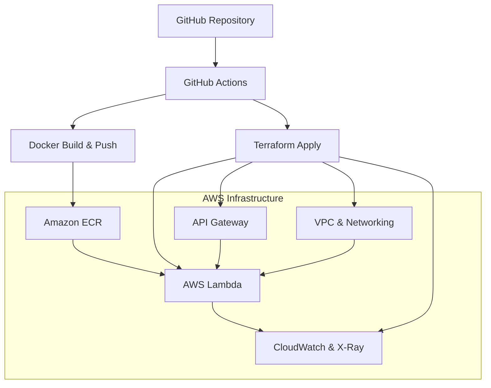

# AWS Lambda Container Deployment with Terraform

This project demonstrates a complete DevOps pipeline for deploying a containerized "Hello World" application to AWS Lambda using Infrastructure as Code (Terraform), CI/CD (GitHub Actions), and comprehensive monitoring.

##  Architecture



## 🚀 Features

### Core Infrastructure
- **VPC**: Multi-AZ setup with public and private subnets
- **AWS Lambda**: Container-based functions with proper IAM roles
- **API Gateway**: RESTful API with proper integration
- **ECR**: Container registry with lifecycle policies
- **Monitoring**: CloudWatch Logs, Metrics, Alarms, and X-Ray tracing

### DevOps Best Practices
- **Infrastructure as Code**: Modular Terraform configuration
- **CI/CD Pipeline**: Automated build, test, and deployment
- **Multi-Environment**: Support for dev, staging, and prod
- **State Management**: Remote state with S3.
- **Security**: Least privilege IAM, VPC isolation, encryption

## Project Structure

```
├── terraform/                 # Terraform infrastructure code
│   ├── modules/              # Reusable Terraform modules
│   │   ├── vpc/             # VPC and networking
│   │   ├── ecr/             # ECR repository
│   │   ├── lambda/          # Lambda function
│   │   ├── api_gateway/     # API Gateway
│   │   └── monitoring/      # CloudWatch and X-Ray
│   ├── environments/        # Environment-specific configs
│   │   ├── dev/
│   │   ├── staging/
│   │   └── prod/
│   ├── main.tf             # Main Terraform configuration
│   ├── variables.tf        # Input variables
│   └── outputs.tf          # Output values
├── app/                    # Application code
│   ├── app.py             # Lambda function handler
│   └── requirements.txt   # Python dependencies
├── .github/workflows/     # GitHub Actions workflows
│   ├── terraform.yml      # Infrastructure CI/CD
│   └── build-and-deploy.yml # Application CI/CD
├── scripts/               # Utility scripts
│   ├── setup-terraform-backend.sh
│   └── deploy.sh
├── Dockerfile            # Container definition
└── README.md            # This file
```

## Prerequisites

- AWS CLI configured with appropriate permissions
- Terraform >= 1.5.0
- Docker
- GitHub repository with required secrets

## Required GitHub Secrets

Set these secrets in your GitHub repository:

```bash
AWS_ACCESS_KEY_ID         # AWS access key
AWS_SECRET_ACCESS_KEY     # AWS secret key
TF_STATE_BUCKET          # S3 bucket for Terraform state
ECR_REPOSITORY_URI       # ECR repository URI (after first deployment)
```

##  Quick Start

### 1. Set Up Terraform Backend

First, create the S3 bucket for Terraform state:

```bash
chmod +x scripts/setup-terraform-backend.sh
./scripts/setup-terraform-backend.sh
```

This will output the bucket name and table name to add to your GitHub secrets.

### 2. Initial Infrastructure Deployment

```bash
# Clone the repository
git clone <your-repo-url>
cd hello-world-lambda

# Set environment variables
export TF_STATE_BUCKET="your-terraform-state-bucket"
export AWS_REGION="ap-south-1"

# Deploy to dev environment
./scripts/deploy.sh dev
```

### 3. Set Up CI/CD

1. Add the required secrets to your GitHub repository
2. Push changes to trigger the CI/CD pipeline
3. The pipeline will automatically deploy to different environments based on the branch

## CI/CD Workflows

### Terraform Workflow
- **Trigger**: Changes to `terraform/` directory
- **Actions**:
  - Validate and format check on all PRs
  - Plan on pull requests (with PR comments)
  - Apply on merge to main branch

### Build and Deploy Workflow
- **Trigger**: Changes to `app/` or `Dockerfile`
- **Actions**:
  - Build and push Docker image to ECR
  - Update Lambda functions across environments
  - Run integration tests

## Infrastructure Components

### VPC Module
- Multi-AZ VPC with public and private subnets
- NAT Gateways for private subnet internet access
- Security groups with least privilege access
- VPC endpoints for AWS services

### Lambda Module
- Container-based Lambda function
- VPC configuration for secure networking
- IAM roles with minimal required permissions
- X-Ray tracing enabled

### API Gateway Module
- RESTful API with proxy integration
- CloudWatch logging enabled
- Custom domain support (optional)
- CORS configuration

### Monitoring Module
- CloudWatch log groups with retention policies
- Custom dashboards for metrics visualization
- Alarms for error rates and performance
- SNS topics for alerting

## Monitoring and Observability

### CloudWatch Dashboards
Access your monitoring dashboard:
```
https://console.aws.amazon.com/cloudwatch/home?region=ap-south-1#dashboards
```

### Key Metrics Monitored
- Lambda invocation count and duration
- Error rates and success rates
- API Gateway latency and error rates
- Memory and timeout utilization

### X-Ray Tracing
View distributed traces:
```
https://console.aws.amazon.com/xray/home?region=ap-south-1#/service-map
```

## Local Development

### Testing Lambda Function Locally
```bash
cd app
python app.py
```

### Building Docker Image Locally
```bash
docker build -t hello-world-lambda .
docker run -p 9000:8080 hello-world-lambda
```

### Testing with Docker
```bash
curl -XPOST "http://localhost:9000/2015-03-31/functions/function/invocations" -d '{}'
```

## Multi-Environment Management

### Environment Differences
- **Dev**: Minimal resources, relaxed monitoring
- **Staging**: Production-like setup for testing
- **Prod**: High availability, strict monitoring, encryption

### Deploying to Specific Environment
```bash
# Deploy to staging
./scripts/deploy.sh staging

# Deploy to production
./scripts/deploy.sh prod
```

## Security Considerations

### IAM Security
- Least privilege principle applied to all roles
- No hardcoded credentials
- Regular access review recommended

### Network Security
- Lambda functions in private subnets
- VPC endpoints for AWS service access
- Security groups with minimal required access

### Data Security
- Encryption at rest for S3 
- Encryption in transit for all communications
- CloudWatch logs encryption

## Troubleshooting

### Common Issues

1. **Terraform State Lock**
   ```bash
   # Force unlock (use carefully)
   terraform force-unlock LOCK_ID
   ```

2. **Lambda Function Not Updating**
   ```bash
   # Check if image exists in ECR
   aws ecr describe-images --repository-name hello-world-lambda
   ```

3. **API Gateway 502 Errors**
   - Check Lambda function logs in CloudWatch
   - Verify VPC configuration and NAT Gateway connectivity

### Debugging Commands
```bash
# Check Lambda function status
aws lambda get-function --function-name hello-world-lambda-dev-hello-world

# View recent logs
aws logs tail /aws/lambda/hello-world-lambda-dev-hello-world --follow

# Test API Gateway endpoint
curl -v https://your-api-id.execute-api.ap-south-1.amazonaws.com/dev
```

