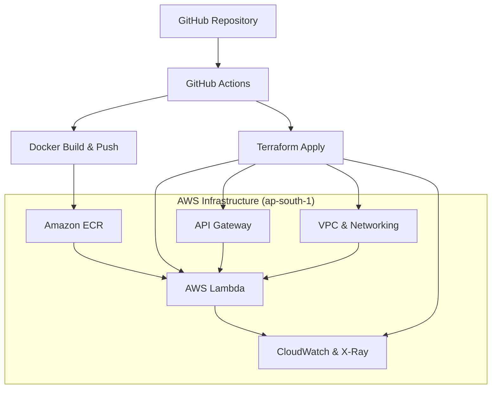

# Hello World Lambda Container Deployment

This project demonstrates a complete DevOps pipeline for deploying a containerized "Hello World" Lambda function using AWS services, Terraform for Infrastructure as Code, and GitHub Actions for CI/CD.

## Architecture Overview





### Core Components

- **AWS Lambda**: Containerized function using ECR images
- **Amazon ECR**: Container registry for Docker images
- **API Gateway**: REST API to trigger Lambda functions
- **VPC**: Multi-AZ setup with public and private subnets
- **CloudWatch**: Monitoring and logging
- **X-Ray**: Distributed tracing

### Infrastructure Features

- **Multi-Environment Support**: dev, staging, prod
- **Remote State Management**: Uses existing S3 bucket with file-based locking
- **Security**: VPC isolation, IAM roles, security groups
- **Monitoring**: CloudWatch alarms and X-Ray tracing
- **CI/CD**: Automated testing, building, and deployment
- **Pure Terraform**: No shell scripts, only Infrastructure as Code

## Project Structure

```
├── terraform/
│   ├── main.tf                   # Main Terraform configuration
│   ├── variables.tf              # Input variables
│   ├── outputs.tf                # Output values
│   ├── modules/                  # Reusable Terraform modules
│   │   ├── vpc/                  # VPC and networking
│   │   ├── ecr/                  # ECR repository
│   │   ├── lambda/               # Lambda function
│   │   ├── api-gateway/          # API Gateway
│   │   └── cloudwatch/           # Monitoring
│   └── environments/             # Environment-specific configs
│       ├── dev/
│       ├── staging/
│       └── prod/
├── src/lambda/                   # Lambda function source code
├── .github/workflows/            # GitHub Actions workflows
├── Dockerfile                    # Lambda container image
└── README.md
```

## Prerequisites

- AWS CLI configured with appropriate permissions
- Terraform >= 1.0
- Docker
- GitHub repository with Actions enabled
- **Existing Terraform state bucket**: `usecases-terraform-state-bucket`

## State Management

This project uses your existing Terraform state infrastructure with file-based locking:

- **S3 Bucket**: `usecases-terraform-state-bucket`
- **State Key Pattern**: `usecase6/{environment}/terraform.tfstate`
- **Region**: `ap-south-1`
- **Encryption**: Enabled
- **Locking**: File-based locking (`use_lockfile = true`)

### Environment State Keys:
- **Dev**: `usecase6/dev/terraform.tfstate`
- **Staging**: `usecase6/staging/terraform.tfstate`
- **Prod**: `usecase6/prod/terraform.tfstate`

### State Locking Mechanism:
```hcl
terraform {
  backend "s3" {
    bucket        = "usecases-terraform-state-bucket"
    key           = "usecase6/statefile.tfstate"
    region        = "ap-south-1"
    encrypt       = true
    use_lockfile  = true
  }
}
```

**File-based Locking Benefits:**
- ✅ **No DynamoDB Required**: Uses S3 lock files instead
- ✅ **Automatic Conflict Prevention**: Terraform handles lock acquisition/release
- ✅ **Cost Effective**: No additional AWS service charges
- ✅ **Simple Setup**: Works with existing S3 bucket

## Setup Instructions

### 1. GitHub Actions Setup

1. **Configure AWS credentials** in GitHub Secrets:
   - `AWS_ROLE_ARN`: ARN of the IAM role for GitHub Actions
   - Set up OIDC provider for secure authentication

2. **Environment Protection Rules**:
   - Set up environment protection rules in GitHub
   - Configure required reviewers for production deployments

### 2. Deploy Infrastructure

**Automatic Deployment:**
- Push changes to `main` branch
- GitHub Actions will automatically plan and apply changes

**Manual Deployment:**
1. Go to **Actions** → **Terraform Infrastructure**
2. Click **Run workflow**
3. Choose environment and action (plan/apply/destroy)

**Local Deployment:**
```bash
cd terraform
terraform init -backend-config=environments/dev/backend.tf
terraform plan -var-file=environments/dev/terraform.tfvars
terraform apply -var-file=environments/dev/terraform.tfvars
```

## Deployment Process

### Infrastructure Deployment
```
Terraform Workflow → VPC → ECR → Lambda → API Gateway → CloudWatch
```

### Application Deployment
```
Docker Build Workflow → Build Image → Push to ECR → Update Lambda
```

## Lambda Container Image Challenge Solution

The project solves the "Lambda expecting Docker image from ECR" challenge through:

### **Pure Terraform Approach:**

1. **ECR Repository Creation**: Created first via Terraform
2. **Placeholder Image**: Terraform creates a minimal placeholder image if none exists
3. **Lifecycle Management**: Lambda uses `ignore_changes = [image_uri]` to prevent errors
4. **CI/CD Integration**: GitHub Actions builds and pushes the actual application image
5. **Automatic Updates**: Lambda function gets updated with new images via CI/CD

### **No Scripts Required:**

- ✅ **Infrastructure**: Pure Terraform modules
- ✅ **Deployment**: GitHub Actions with Terraform commands
- ✅ **Container Management**: ECR lifecycle policies via Terraform
- ✅ **Lambda Updates**: AWS CLI commands in GitHub Actions
- ✅ **State Management**: Uses existing S3 bucket with file-based locking

## Environment Configuration

### Development Environment
- **Purpose**: Development and testing
- **VPC CIDR**: 10.0.0.0/16
- **State Key**: `usecase6/dev/terraform.tfstate`
- **Resources**: Minimal configuration for cost optimization

### Staging Environment
- **Purpose**: Pre-production testing
- **VPC CIDR**: 10.1.0.0/16
- **State Key**: `usecase6/staging/terraform.tfstate`
- **Resources**: Production-like configuration

### Production Environment
- **Purpose**: Live production workloads
- **VPC CIDR**: 10.2.0.0/16
- **State Key**: `usecase6/prod/terraform.tfstate`
- **Resources**: High availability and performance

## API Usage

Once deployed, the API Gateway provides endpoints to access your Lambda function:

```bash
# Get the API Gateway URL from Terraform output
curl https://<api-id>.execute-api.ap-south-1.amazonaws.com/dev/

# Example response
{
  "message": "Hello World from Lambda Container!",
  "environment": "dev",
  "timestamp": "2024-01-01T12:00:00.000Z",
  "requestId": "abc123",
  "path": "/",
  "httpMethod": "GET"
}
```

## Monitoring and Logging

### CloudWatch Logs
- Lambda execution logs: `/aws/lambda/{function-name}`
- API Gateway logs: Available in the API Gateway console

### CloudWatch Metrics
- Lambda duration and error rates
- API Gateway request metrics
- Custom alarms for monitoring

### X-Ray Tracing
- Distributed tracing enabled for Lambda functions
- View request traces in the X-Ray console

## Security Features

### Network Security
- VPC with private subnets for Lambda
- Security groups with minimal required access
- NAT Gateways for outbound internet access

### IAM Security
- Least privilege IAM roles
- Function-specific execution roles
- Resource-based policies

### Data Security
- S3 state encryption
- ECR image scanning
- VPC endpoints for AWS services (optional)

## Troubleshooting

### Common Issues

1. **Lambda Function Not Updating**:
   - Check if ECR image exists and is accessible
   - Verify IAM permissions for Lambda service
   - Check VPC configuration and security groups

2. **API Gateway 5xx Errors**:
   - Check Lambda function logs in CloudWatch
   - Verify Lambda function is in running state
   - Check API Gateway integration configuration

3. **Terraform State Lock Issues**:
   - File-based locking automatically handles conflicts
   - If lock file gets stuck, check S3 bucket for `.tflock` files
   - Use `terraform force-unlock` if necessary (with caution)

### Useful Commands

```bash
# Check Lambda function status
aws lambda get-function --function-name hello-world-lambda-dev

# View Lambda logs
aws logs tail /aws/lambda/hello-world-lambda-dev --follow

# Test Lambda function locally
aws lambda invoke --function-name hello-world-lambda-dev response.json

# List ECR images
aws ecr list-images --repository-name hello-world-lambda-dev

# Check for stuck lock files
aws s3 ls s3://usecases-terraform-state-bucket/usecase6/ --recursive | grep .tflock
```

## Workflow Commands

### Deploy Infrastructure
```bash
# Via GitHub Actions
Actions → Terraform Infrastructure → Run workflow → Select environment → Apply

# Via Local Terraform
cd terraform
terraform init -backend-config=environments/dev/backend.tf
terraform apply -var-file=environments/dev/terraform.tfvars
```

### Build and Deploy Application
```bash
# Via GitHub Actions (automatic on push to main)
git push origin main

# Manual trigger
Actions → Build and Push Docker Image → Run workflow → Select environment
```

### Destroy Infrastructure
```bash
# Via GitHub Actions
Actions → Terraform Infrastructure → Run workflow → Select environment → Destroy

# Via Local Terraform
cd terraform
terraform destroy -var-file=environments/dev/terraform.tfvars
```

## State Management Details

### Backend Configuration

The project uses your existing state bucket with file-based locking:

```hcl
terraform {
  backend "s3" {
    bucket        = "usecases-terraform-state-bucket"
    key           = "usecase6/statefile.tfstate"
    region        = "ap-south-1"
    encrypt       = true
    use_lockfile  = true
  }
}
```

### Environment Separation

Each environment maintains its own state file:
- **Dev**: `usecase6/dev/terraform.tfstate`
- **Staging**: `usecase6/staging/terraform.tfstate`
- **Prod**: `usecase6/prod/terraform.tfstate`

### Lock File Management

Terraform automatically creates and manages lock files in S3:
- **Lock Files**: `usecase6/{environment}/terraform.tfstate.tflock`
- **Automatic Cleanup**: Terraform removes lock files after operations
- **Conflict Prevention**: Multiple users cannot modify state simultaneously

## Cost Optimization

- Use appropriate Lambda memory settings
- Implement lifecycle policies for ECR images
- Use CloudWatch log retention policies
- Consider using Lambda provisioned concurrency for production

## Contributing

1. Create a feature branch
2. Make your changes
3. Run Terraform format and validate
4. Create a pull request
5. Review and merge after approval

**Note**: File-based locking automatically prevents concurrent modifications to state files.

## Support

For issues and questions:
1. Check the troubleshooting section
2. Review CloudWatch logs
3. Create an issue in the repository
4. Contact the DevOps team

---

This infrastructure demonstrates production-ready practices for containerized Lambda deployment with proper security, monitoring, and CI/CD integration using pure Terraform and GitHub Actions - leveraging your existing state management infrastructure with file-based locking for safe concurrent operations.